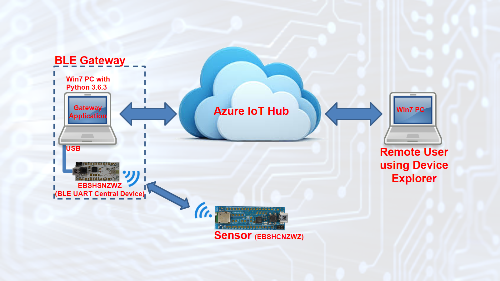
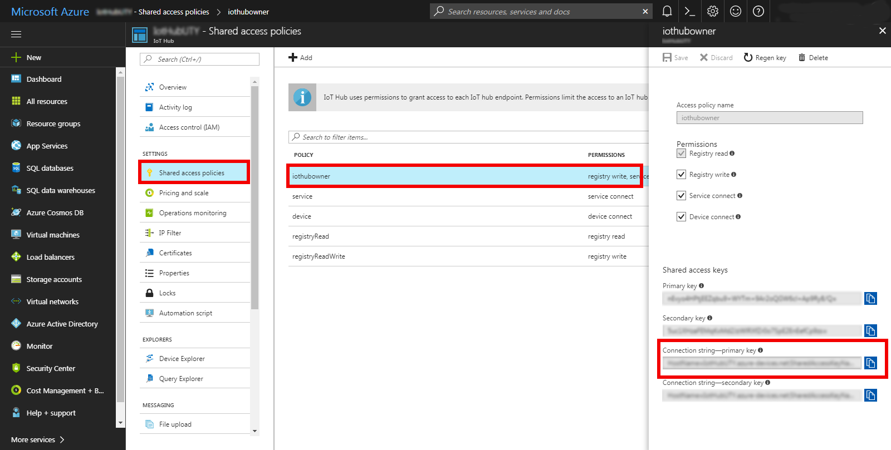
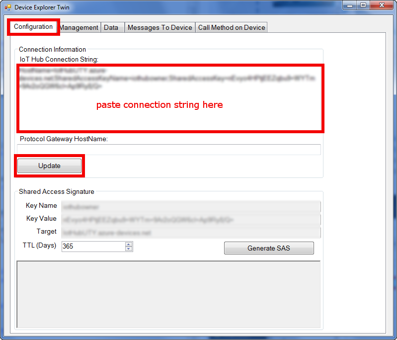
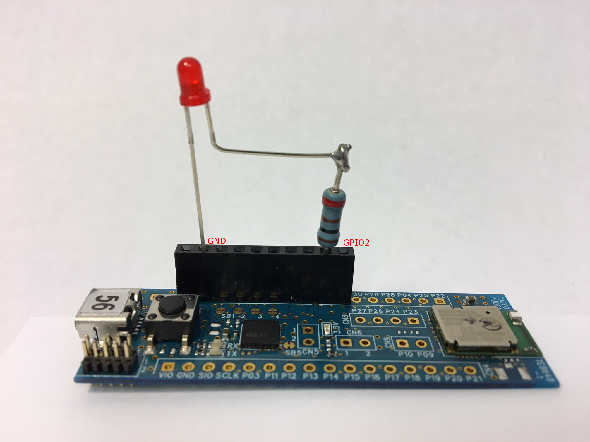
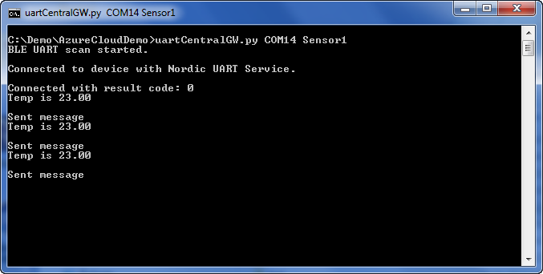
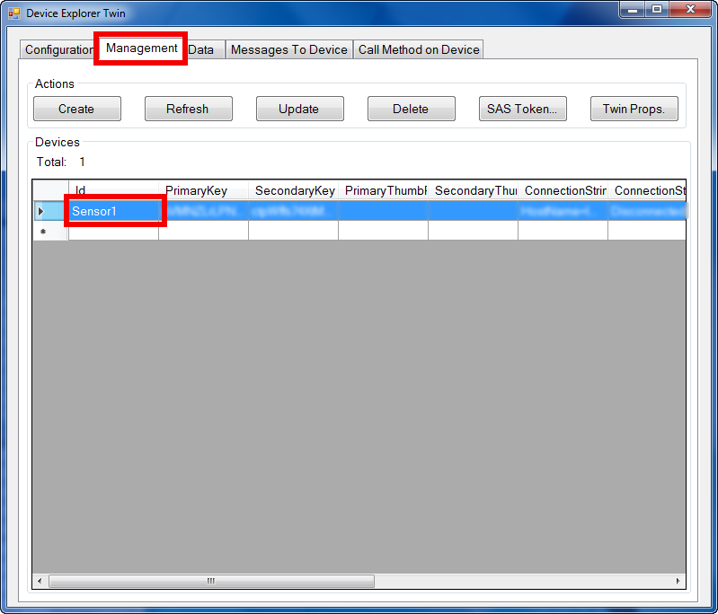
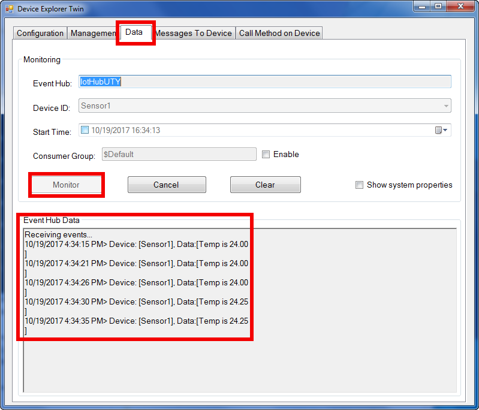
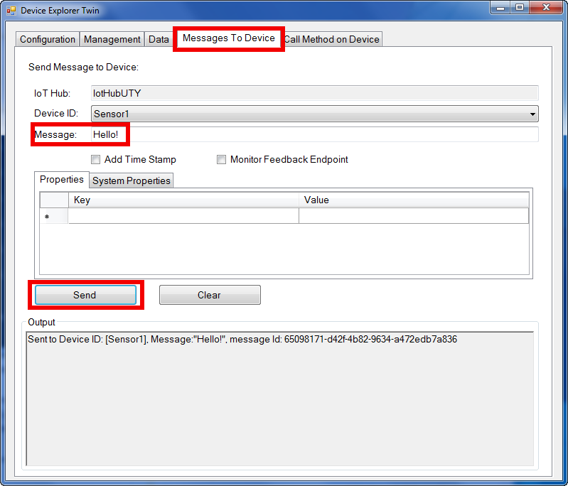

# Hey! You! Get onto the Cloud
Have you been thinking about connecting your Bluetooth device to the cloud? Maybe you have a sensor and you want to monitor it remotely? Or maybe you want to control some lights remotely? Whatever it is, if you've never connected a device to the cloud before, you might find yourself overwhelmed by the amount of information you'll need to learn just to get started. To help make the ramp-up a little bit easier, this tutorial will show you a simple example of how to connect a sensor to the cloud. We'll use Taiyo Yuden's Bluetooth low energy (BLE) module to simulate a temperature ***Sensor*** (see Figure 1). The ***Sensor*** will then connect to a ***BLE Gateway***, which then forwards the sensor data to ***Microsoft's Azure IoT Hub***. We'll then use ***Microsoft's Device Explorer*** to monitor the data remotely, and to send messages to the ***Sensor***.

Figure 1: Tutorial Setup

# Create an Azure IoT Hub
1. The 1st thing to do is create an Azure account here... [https://azure.microsoft.com/en-us/free/](https://azure.microsoft.com/en-us/free/).
2. Once you have an Azure account, create an ***Azure IoT Hub*** by following the instructions here... [https://docs.microsoft.com/en-us/azure/iot-hub/iot-hub-create-through-portal](https://docs.microsoft.com/en-us/azure/iot-hub/iot-hub-create-through-portal)
3. After creating the ***Hub***, copy the ***Hub Connection String***. To copy (see Figure 2), click ***Shared access policies***, then click  ***iothubowner***, and the ***Connection String*** will be on the bottom right. Save the connection string into a text file. This will be used to configure ***Device Explorer*** and the ***BLE Gateway***.

Figure 2: Connection String

# Configure Device Explorer
1. Download and install  ***Device Explorer*** (i.e. SetupDeviceExplorer.msi). Download it from here... [https://github.com/Azure/azure-iot-sdk-csharp/releases](https://github.com/Azure/azure-iot-sdk-csharp/releases). You can install it on the same PC as the ***BLE Gateway***. It doesn't have to be installed on a different PC.
2. Launch ***Device Explorer*** and select the ***Configuration*** tab. Then paste the ***Hub Connection String*** as shown on Figure 3 below. Then click ***Update***.

Figure 3: Device Explorer Configuration Setting

# Get the Sensor up and Running
**Prerequisites:**
		
- This tutorial assumes that you already know how to compile and flash the sample code from the Nordic Semiconductor SDK (i.e. You have your IDE, the J-Link Lite board, and already know how to use it).		
- Download and extract [SDK v14.0.0](https://developer.nordicsemi.com/nRF5_SDK/nRF5_SDK_v14.x.x/) (i.e. nRF5_SDK_14.0.0_3bcc1f7.zip) into a directory of your choice.

__Sensor:__

The ***Sensor*** is implemented on an [EBSHCNZWZ](https://www.yuden.co.jp/wireless_module/document/evbmanual2/TY_BLE_EYSHCN_EVBManual_V1_3_20170925.pdf) eval board (see Figure 4). It is based on Nordic Semiconductor's [ble_app_uart](http://infocenter.nordicsemi.com/topic/com.nordic.infocenter.sdk5.v14.0.0/ble_sdk_app_nus_eval.html?cp=4_0_1_4_1_2_24) (i.e. UART/Serial Port Emulation over BLE) sample app, but with some minor modifications on the main.c file. The modifications are as follows:

- Code was added to configure GPIO2 as an output so that it can drive an LED. The state of the LED is toggled every time the sensor receives a message from the ***Hub***.		
- Code was added to read the nRF52832's die temperature every 5 seconds. The temperature reading is then sent to the ***BLE Gateway***.

The main.c file for the sample app is located in `<SDKInstallFolder>\examples\ble_peripheral\ble_app_uart` folder. Replace this main.c with [Taiyo Yuden's version of the main.c](BLE-Sensor/main.c). Then compile and flash the code into the eval board. The ***Sensor*** is now ready to use. Please note that the ***Sensor*** automatically goes into advertising mode right after reset.

Figure 4: EBSHCNZWZ Eval Board as a Sensor. LED and 110 Ohm resistor driven by GPIO2.

# Get the BLE Gateway up and Running
The ***BLE Gateway*** has two main components: the [Gateway Application](BLE-Gateway/BLE-Gateway-Python-Application/) and the [BLE UART Central Device](BLE-Gateway/BLE-UART-Central-Device/). The ***Gateway Application*** is written in Python and runs on a Windows 7 PC. The ***BLE UART Central Device*** is Taiyo Yuden's [EBSHSNZWZ](https://www.yuden.co.jp/wireless_module/document/evbmanual2/TY_BLE_EYSHSN_EVBManual_V1_1_20170925.pdf) eval board configured as a Bluetooth central device that simulates a UART connection over BLE.

## Gateway Application ##
As mentioned earlier, the [Gateway Application](BLE-Gateway/BLE-Gateway-Python-Application/) is written in Python. Why? Because Python has libraries that make it easy to connect to the cloud (i.e. [Requests](http://docs.python-requests.org/en/master/) and [Paho MQTT](https://www.eclipse.org/paho/clients/python/docs/)). With Python, the Request library gives us HTTP functionality, and Paho gives us MQTT. HTTP and MQTT  are protocols supported by the ***Azure IoT Hub***. We will use HTTP to provision the ***Sensor***. MQTT will be used to send sensor data to the ***Hub*** and to send messages to the ***Sensor***.

The [Gateway Application](BLE-Gateway/BLE-Gateway-Python-Application/) is comprised of 3 python files: ***deviceManager.py***, ***d2cMsgSender.py*** and ***uartCentralGW.py***.		
     
- [deviceManager.py](BLE-Gateway/BLE-Gateway-Python-Application/deviceManager.py) is used to add a device to the ***Hub***. This is just a modified version (i.e. modified so that it works on Python 3.6.3) of the example here... [https://azure.microsoft.com/en-us/resources/samples/iot-hub-python-get-started/](https://azure.microsoft.com/en-us/resources/samples/iot-hub-python-get-started/).				
- [d2cMsgSender.py](BLE-Gateway/BLE-Gateway-Python-Application/d2cMsgSender.py) is used to generate the SAS Token. This is just a modified version (i.e. modified so that it works on Python 3.6.3) of the example here... [https://azure.microsoft.com/en-us/resources/samples/iot-hub-python-get-started/](https://azure.microsoft.com/en-us/resources/samples/iot-hub-python-get-started/).				
- [uartCentralGW.py](BLE-Gateway/BLE-Gateway-Python-Application/uartCentralGW.py) is the main application file. It's based on the example here... [https://kevinsaye.wordpress.com/2016/09/16/connect-to-azure-iot-hub-from-python/](https://kevinsaye.wordpress.com/2016/09/16/connect-to-azure-iot-hub-from-python/)

**Prerequisites:**		
 
- Install [Python 3.6.3](https://www.python.org/ftp/python/3.6.3/python-3.6.3.exe)
- Install requests library (pip install requests)
- Install paho-mqtt library (pip install paho-mqtt)
- Install pyserial library (pip install pyserial)
- [Download the Baltimore Cyber Trust Root Certificate](https://ssl-tools.net/certificates/d4de20d05e66fc53fe1a50882c78db2852cae474.pem).
- Modify ***uartCentralGW.py*** so that ***BaltimoreCyberTrustRootCER*** path is set to the path where you stored the certificate
- Modify ***uartCentralGW.py*** so that ***connectionString*** is set to your ***Hub's Connection String***

**Usage:**		  
uartCentralGW.py `<serial port>` `<devicename>`   
`serial port`:  Serial port to use (e.g. COM8, use Windows Device Manager to determine port number)   
`devicename`: name of device (e.g. Sensor1) that will be added to the ***Hub***

When launched, the ***Gateway Application*** will send the scan command to the ***BLE UART Central Device***. The ***BLE UART Central Device*** will then scan for a ***Sensor*** that supports the ***Nordic UART Service***. If it successfully connects with the ***Sensor***, the ***Gateway Application*** will add the name of sensor to the ***Hub***, create a MQTT Client, connect to the ***Hub***, and then start sending temperature readings to the ***Hub***.

## BLE UART Central Device ##
The [BLE UART Central Device](BLE-Gateway/BLE-UART-Central-Device) is based on Nordic Semiconductor's [ble_app_uart_c](http://infocenter.nordicsemi.com/topic/com.nordic.infocenter.sdk5.v14.0.0/ble_sdk_app_nus_c.html?cp=4_0_1_4_1_0_4) (i.e. Nordic UART Service Client) sample app, which is included in [SDK v14.0.0](https://developer.nordicsemi.com/nRF5_SDK/nRF5_SDK_v14.x.x/). The sample app automatically goes into scan right after reset. However, for this tutorial, the main.c file of the app was modified to start scanning only after it receives a scan command from the [Gateway Application](BLE-Gateway/BLE-Gateway-Python-Application). The main.c of the sample app is located in `<SDKInstallFolder>\examples\ble_central\ble_app_uart_c.` Replace this main.c file with [Taiyo Yuden's version of main.c](BLE-Gateway/BLE-UART-Central-Device/main.c). Then compile and flash the code into the [EBSHSNZWZ](https://www.yuden.co.jp/wireless_module/document/evbmanual2/TY_BLE_EYSHSN_EVBManual_V1_1_20170925.pdf) eval board. The ***BLE Gateway*** is now ready to use.  

# Run the Demo
To run the demo...		

1. Launch ***Device Explorer***.				
2. Power up the ***Sensor***. It should automatically go into advertising mode.	
3. Start the ***BLE Gateway***. Connect the USB connector of the ***BLE UART Central Device*** (i.e. the EBSHSNZWZ) to the PC and determine the COM port number via the Windows Device Manager. Launch the ***Gateway Application*** (e.g. If you have COM14, launch it as follows... ***uartGWCentral.py COM14 Sensor1***). NOTE: To make sure that the eval board is in a known state, it is recommended that you always press the reset button on the eval board prior to launching the ***Gateway Application***.				

If it's working correctly, you should see something similar to Figure 5 below. ***Connected to device with Nordic UART Service*** means the ***BLE Gateway*** successfully connected with the ***Sensor***. ***Connected with result code: 0*** means the ***BLE Gateway*** successfully connected with the ***Azure IoT Hub***. You should also see the temperature reading received from the ***Sensor***, and ***Sent message*** means the received temperature reading was sent to the ***Hub***.

Figure 5: BLE Gateway indicating successful connection and receiving temperature readings from ***Sensor1***.

Now let's look at ***Device Explorer***. If you click the ***Management*** tab, you should see that ***Sensor1*** was added (see Figure 6) .

Figure 6: Device Explorer showing Sensor1 was added to the ***Hub***

To see the data received by the ***Hub***, click the ***Data*** tab and then click ***Monitor*** (see Figure 7).

Figure 7: Device Explorer showing the received temperature readings

To send a message to ***Sensor1***, click the ***Message To Device*** tab. Type something on the ***Message:*** field (e.g. Hello!) and then click ***Send*** (see Figure 8). 

Figure 8: Send a message to the sensor		
				
If ***Sensor1*** receives the message, the LED should turn on.

# Closing Remarks

We hope that you find this tutorial helpful. This really just scratches the surface. It's just one example on how to connect to the cloud. There are many other ways to do it, but hopefully this helps you get started. Make sure you look at the references below to help better understand the example provided here. 

# References
- [https://azure.microsoft.com/en-us/resources/samples/iot-hub-python-get-started/](https://azure.microsoft.com/en-us/resources/samples/iot-hub-python-get-started/)		
- [https://kevinsaye.wordpress.com/2016/09/16/connect-to-azure-iot-hub-from-python/](https://kevinsaye.wordpress.com/2016/09/16/connect-to-azure-iot-hub-from-python/)
- [Python Requests](http://docs.python-requests.org/en/master/)
- [Paho MQTT](https://www.eclipse.org/paho/clients/python/docs/)
- [Nordic Semiconductor Infocenter](http://infocenter.nordicsemi.com/index.jsp)		 
- [EYSHSNZWZ Taiyo Yuden Bluetooth 5 Module](http://www.yuden.co.jp/ut/product/category/module/EYSHSNZWZ.html)		
- [EYSHJNZWZ Taiyo Yuden Bluetooth 5 Module](http://www.yuden.co.jp/ut/product/category/module/EYSHJNZWZ.html)		 
- [EYSHCNZWZ Taiyo Yuden Bluetooth 5 Module](http://www.yuden.co.jp/ut/product/category/module/EYSHCNZWZ.html)		

# Contact and Purchase
To contact your Taiyo Yuden local sales office, visit [http://www.ty-top.com/](http://www.ty-top.com/)    

**To purchase visit:**    
[Avnet](http://www.avnet.com)   
[Digi-Key](http://www.digikey.com)      
[Future Electronics](http://www.futureelectronics.com)    
[Mouser](http://www.mouser.com)     
[Symmtery Electronics](http://www.semiconductorstore.com)    
[Taiyo Yuden](http://www.ty-top.com)    
